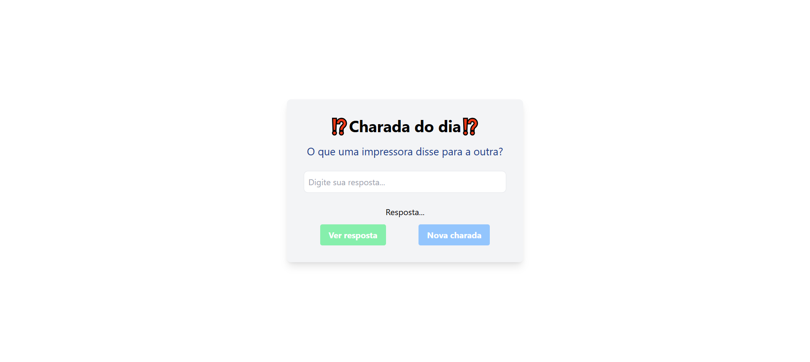

# 🎭 Charada do Dia

Uma aplicação web divertida e interativa que apresenta charadas diárias para desafiar seu raciocínio!  

## 🚀 Tecnologias Utilizadas  

Este projeto foi desenvolvido utilizando as seguintes tecnologias:  

      

## 📸 Print da tela inicial 

Abaixo está uma imagem da interface do projeto:  

  

## 🛠 Funcionalidades  

✅ Exibe uma charada aleatória a cada interação.  
✅ Permite que o usuário tente responder antes de ver a resposta.  
✅ Interface limpa e intuitiva.  
✅ Estilizado com Tailwind CSS para um design moderno.  

## 🔐 Seção do ADM

Senha: admin123
  
## 🌍 Teste o Projeto Online  

Você pode testar a aplicação diretamente na Vercel clicando no botão abaixo:  

  

Se o botão não funcionar, copie e cole o seguinte link no seu navegador:  

🔗 **[Acesse o projeto aqui](https://api-charadas-six.vercel.app)**  

---

## 👨‍💻 Desenvolvido por  

Projeto desenvolvido por **Lígia da Costa Silva**  - 2025

🔗 Conecte-se comigo no [LinkedIn](www.linkedin.com/in/lígia-costa-16080118b)  
📂 Veja mais projetos no [GitHub](https://github.com/Ligia-Costa)  

